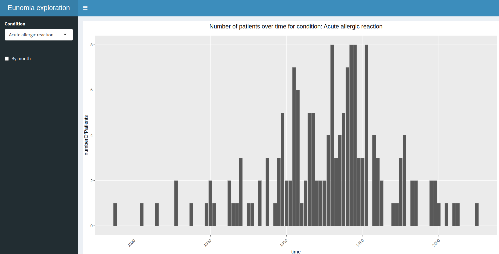

### Eunomia Exploration

#### Introduction

Eunomia is a standard dataset in the OMOP (Observational Medical Outcomes Partnership) Common Data Model (CDM) for testing and demonstration purposes. Eunomia is used for many of the exercises in [the Book of OHDSI](https://ohdsi.github.io/TheBookOfOhdsi/). Eunomia is part of [HADES](https://ohdsi.github.io/Hades/).

This package has been created to show how one can use Eunomia to extract and visualize data.

#### Functions

This package contains 3 man functions:

* extractPatients: this function takes a database connection as input, and extracts information on condition, start and end date of the condition from the condition occurrence table in the database.

* plotTrend(data, byMonth): takes as input the output from the extractPatients function, and provides a calendar month and year plotting option. Creates a bar plot with the number of patients per year (default) or month for each condition in "data".

* createShinyApp: simple shiny app should have a pulldown menu to select the condition and a checkbox for by month. The app plots the frequency of the selected condition by the selected time variance (Year or Month)

#### Examples

```R
library(EunomiaExploration)

connectionDetails <- Eunomia::getEunomiaConnectionDetails()
dbConnection      <- DatabaseConnector::connect(connectionDetails)

df <- EunomiaExploration::extractPatients(dbConnection)

EunomiaExploration::plotTrend(df, byMonth = FALSE)

EunomiaExploration::createShinyApp()

DatabaseConnector::disconnect(dbConnection)
```

#### Shiny app

{width=50% height=50%}
